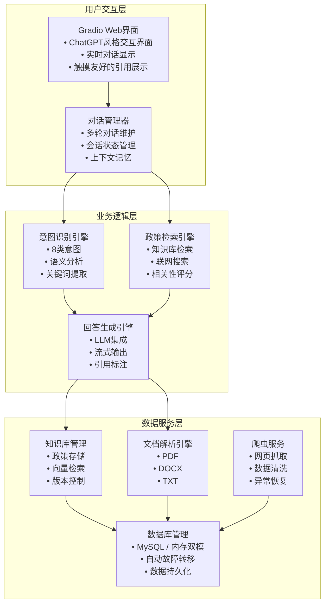

### 前言



```
┌─────────────────────────────────────────┐
│             用户交互层                   │
│  ┌─────────────────────────────────────┐ │
│  │           Gradio Web界面            │ │
│  │  • ChatGPT风格交互界面              │ │
│  │  • 实时对话显示                     │ │
│  │  • 触摸友好的引用展示               │ │
│  └─────────────────────────────────────┘ │
│  ┌─────────────────────────────────────┐ │
│  │           对话管理器                 │ │
│  │  • 多轮对话维护                     │ │
│  │  • 会话状态管理                     │ │
│  │  • 上下文记忆                       │ │
│  └─────────────────────────────────────┘ │
┌─────┼─────────────────────────────────────────┼─────┐
│     ▼                                           │     │
│  ┌─────────────────────────────────────────┐   │     │
│  │            业务逻辑层                   │   │     │
│  │  ┌─────────────┐ ┌────────────────────┐ │   │     │
│  │  │  意图识别   │ │    政策检索        │ │   │     │
│  │  │ 引擎        │ │    引擎            │ │   │     │
│  │  │ • 8类意图   │ │ • 知识库检索       │ │   │     │
│  │  │ • 语义分析  │ │ • 联网搜索         │ │   │     │
│  │  │ • 关键词    │ │ • 相关性评分       │ │   │     │
│  │  └─────────────┘ └────────────────────┘ │   │     │
│  │  ┌────────────────────────────────────┐ │   │     │
│  │  │          回答生成引擎              │ │   │     │
│  │  │ • LLM集成                         │ │   │     │
│  │  │ • 流式输出                        │ │   │     │
│  │  │ • 引用标注                        │ │   │     │
│  │  └────────────────────────────────────┘ │   │     │
│  └─────────────────────────────────────────┘   │     │
│     ▼                                           ▼     │
│  ┌─────────────────────────────────────────┐         │
│  │            数据服务层                   │         │
│  │  ┌───────────┐ ┌──────────┐ ┌─────────┐  │         │
│  │  │ 知识库    │ │ 文档解析 │ │ 爬虫    │  │         │
│  │  │ 管理      │ │ 引擎     │ │ 服务    │  │         │
│  │  │ • 政策存储│ │ • PDF    │ │ • 网页  │  │         │
│  │  │ • 向量检索│ │ • DOCX   │ │ 抓取    │  │         │
│  │  │ • 版本控制│ │ • TXT    │ │ • 数据  │  │         │
│  │  └───────────┘ └──────────┘ └─────────┘  │         │
│  │  ┌────────────────────────────────────┐  │         │
│  │  │          数据库管理                │  │         │
│  │  │ • MySQL/内存双模                   │  │         │
│  │  │ • 自动故障转移                     │  │         │
│  │  │ • 数据持久化                       │  │         │
│  │  └────────────────────────────────────┘  │         │
│  └─────────────────────────────────────────┘         │
└──────────────────────────────────────────────────────┘
```


### 思路

```
政策咨询智能体 - 模块化架构
┌─────────────────────────────────────────────────────────────┐
│                      用户交互层 (Presentation Layer)          │
├─────────────────────────────────────────────────────────────┤
│  • Web界面模块 (Gradio/Streamlit)                           │
│  • 语音交互模块 (可选)                                      │
│  • 移动端适配模块 (可选)                                    │
└─────────────────────────────────────────────────────────────┘
                             │
┌─────────────────────────────────────────────────────────────┐
│                    业务逻辑层 (Business Logic Layer)         │
├─────────────────────────────────────────────────────────────┤
│  • 对话管理模块        • 策略优化模块                        │
│  • 意图识别模块        • 安全验证模块                        │
│  • 政策检索模块        • 缓存管理模块                        │
│  • 回答生成模块        • 监控统计模块                        │
└─────────────────────────────────────────────────────────────┘
                             │
┌─────────────────────────────────────────────────────────────┐
│                    数据服务层 (Data Service Layer)           │
├─────────────────────────────────────────────────────────────┤
│  • 知识库管理模块      • 联网搜索模块                        │
│  • 数据库操作模块      • 文件解析模块                        │
│  • 向量检索模块        • 数据标准化模块                      │
└─────────────────────────────────────────────────────────────┘
                             │
┌─────────────────────────────────────────────────────────────┐
│                    基础设施层 (Infrastructure Layer)         │
├─────────────────────────────────────────────────────────────┐
│  • 模型管理模块        • 配置管理模块                        │
│  • API路由模块         • 日志管理模块                        │
│  • 任务队列模块        • 异常处理模块                        │
└─────────────────────────────────────────────────────────────┘
```

>主体构成
```
┌─────────────────┐    ┌──────────────────┐    ┌─────────────────┐
│   用户交互层     │    │   业务逻辑层      │    │   数据服务层     │
│                 │    │                  │    │                 │
│ • Gradio Web界面 │◄──►│ • 意图识别       │◄──►│ • 政策知识库     │
│ • 多轮对话管理   │    │ • 政策检索       │    │ • 用户对话历史   │
│ • 实时响应       │    │ • 回答生成       │    │ • 更新监控       │
└─────────────────┘    └──────────────────┘    └─────────────────┘
```

智能知识库——————智能语音模型——————智能前端展示效果

>支持效果
- 深度训练大模型（采用deepseek内嵌大模型，结合深度思考内能力。支持自定义在线或离线模型）
- 知识库（数据库：Mysql）
- 联网搜索（）
- 引用展示（智能搜索算法）
- 策略优化（）
- 安全保证（）
- 数据标准化（通过统一json格式管理数据）

>后续待定
- 语音交互（这个比较容易做到）
- 图像识别（不行换个多模态模型得了，话说为什么不直接用官方平台的智能体啊）

>主体代码


>主题风格